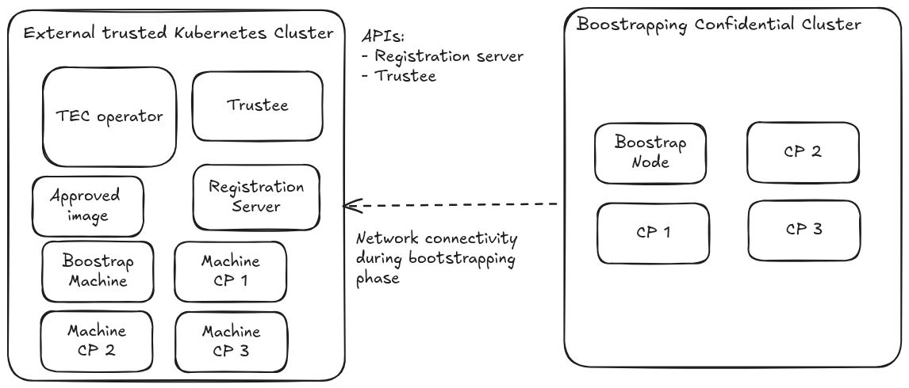

# Bootstrap Phase Design

## Overview

This document describes the bootstrap phase for Trusted Execution Clusters, specifically addressing the challenge of bringing up the first control plane nodes in a confidential computing environment.

## Problem Statement

In a standard Trusted Execution Cluster deployment, the operator and Trustee server run within the cluster itself. However, during the bootstrap phase:

1. **No Control Plane Yet**: The cluster being provisioned has no running control plane to host the operator or Trustee
1. **Attestation Required**: The first control plane nodes still require attestation to ensure they meet security requirements before being trusted
1. **Key Management**: LUKS encryption keys for the bootstrap nodes must be registered and accessible during initial provisioning
1. **Policy Enforcement**: Attestation and resource policies must be in place before the first nodes attempt attestation

## External Trustee and Operator

The bootstrap phase requires an **external trusted Kubernetes cluster** that serves as the trust anchor for provisioning the new confidential cluster. This external cluster hosts the operator and Trustee infrastructure during the bootstrap phase.

### Architecture Overview



## Bootstrap phase

Before beginning the bootstrap phase, the cluster administrator must:

1. **Establish External Trusted Cluster**: Deploy or identify an existing Kubernetes cluster that will serve as the trust anchor
   - This cluster must be considered trusted and secure
   - Must be accessible from the network where new cluster nodes will be provisioned

2. **Deploy Operator on External Cluster**: Install the Trusted Execution Cluster Operator on the external cluster
   - Configure it to manage resources for the new cluster being bootstrapped

3. **Configure Network Accessibility**: Ensure the following endpoints are reachable from the new cluster's network
   - **Registration Service**: Must be accessible by nodes during firstboot for Ignition merge
   - **Attestation Key Registration**: Required for TPM-based attestation key registration
   - **KBS Endpoints**: Required for attestation and key retrieval during both firstboot and subsequent boots

4. **Approve Bootstrap Images**: Create ApprovedImage resources for the bootable images that will be used for bootstrap nodes
   - Ensure reference values are computed and registered with Trustee
   - Verify attestation policies are in place
   
   
## Installation of new cluster

The new cluster nodes needs to have the ability to attest themselves against the external attestation server. Hence, they need to be configured to register and fetch their ignition configuration with the clevis pin and UUID. For more details reference the [design document for the boot phase](https://github.com/trusted-execution-clusters/operator/blob/main/docs/design/boot-attestation.md).

Therefore, for the initial Ignition configuration, their ignition needs to include a merge directive to the external registratio API

```json

{
    "ignition": {
        "config": {
            "merge": [
                {
                    "source": "http://<registration-service>/ignition"
                }
            ]
        }
    }
}
```

During the installation, the nodes will recieved the Ignition configuration with the clevis pin and the list of servers for the attestation.

## Migration of the operator in cluster

Once the cluster has finished the boostrap phase, the Trusted Execution Cluster operator will be deployed in the boostrapped cluster and can start to attest the new upcoming node.

The objects, such as Secrets, Machines, ApprovedImages and AttestationKeys, created during in the boostrap phase need to be mirrored or transfered in the new cluster since the freshly deployed operator needs to have the global vision of the cluster and take over the attestation from the external operator. For example, if one of the initial control plane reboot needs to be able to attest using the attestation endpoint in-cluster. 

