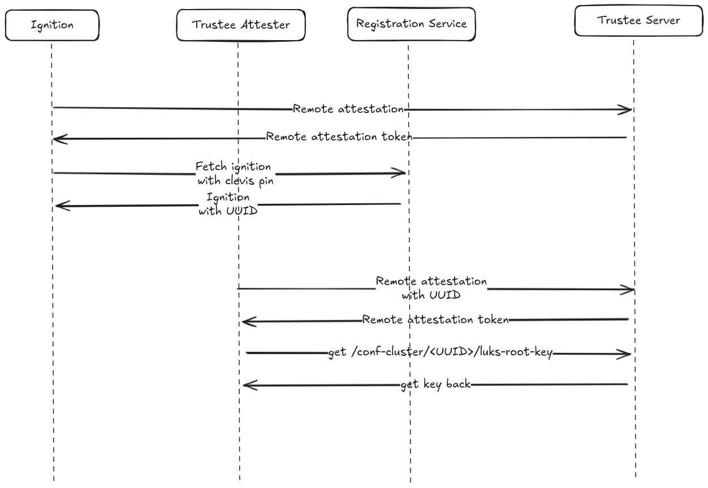

# Ignition Configuration Fetch Protection with 2-phase Attestation

## Overview

This document describes the security mechanism for protecting the Ignition configuration fetch endpoint using attestation. By requiring attestation before serving the Ignition configuration containing the Clevis pin and UUID, the system prevents arbitrary requests from accessing node-specific configuration and registration endpoints.

## Security Challenge

Without protection, the registration service endpoint that serves Ignition configurations with Clevis pin settings and UUIDs is vulnerable to unauthorized accesses, any client can request and receive Ignition configurations and generates UUIDs and secrets, polluting and overloading the operator.

## Protected Fetch Flow

The solution introduces an attestation-protected fetch mechanism where nodes must prove their authenticity before receiving their Ignition configuration.

### Process Flow

1. **Remote Attestation Request**: Ignition initiates a remote attestation with the Trustee Attester
   - Uses generic reference values for the image (no UUID)
   - Proves the platform is running in a confidential computing environment

2. **Attestation Token Received**: Trustee Attester validates the attestation and returns an attestation token
   - Token confirms the node meets basic confidential computing requirements

3. **Protected Ignition Fetch**: Ignition requests its configuration from the Registration Service
   - Includes the attestation token in the request
   - Registration Service validates the token before proceeding

4. From now on, the steps are the ones described in the [booting design document](./docs/design/boot-attestation.md).

