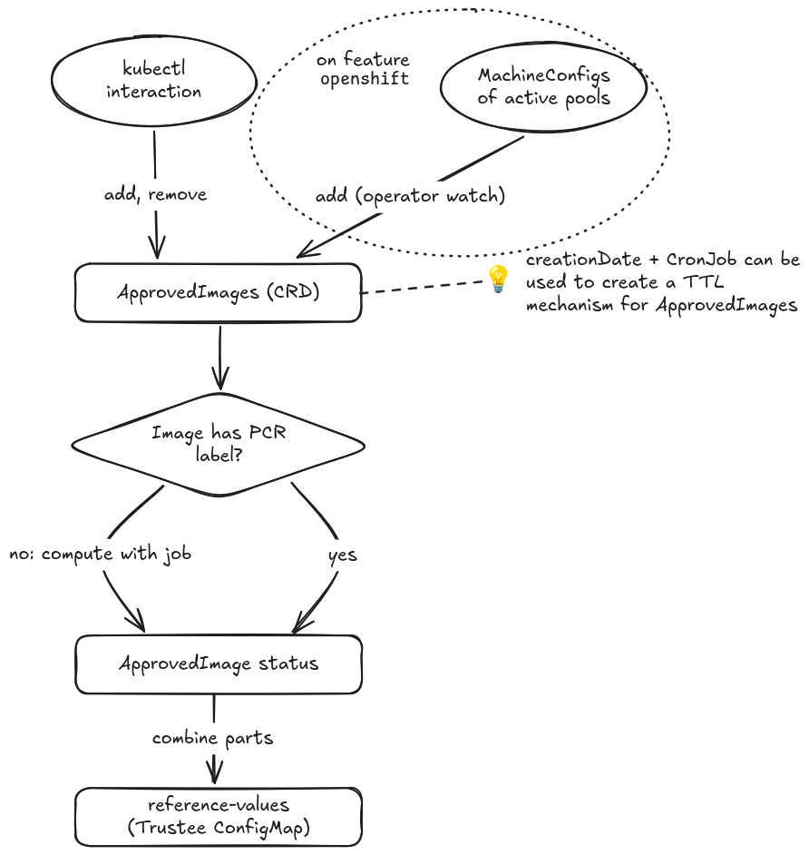
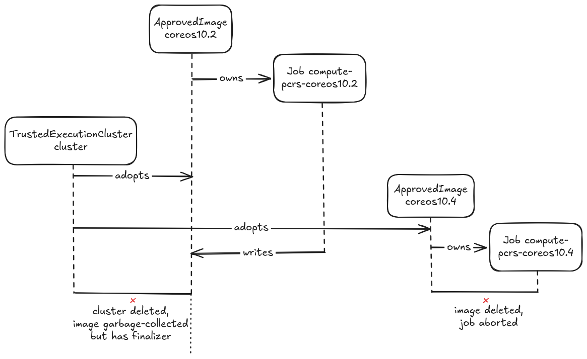

# Reference values data flow

## Overview

Attestation in Trusted Execution Clusters is based on PCR values reported by a TPM.
These values can be predicted when the exact OS the node is expected to be used is known, by means of the [compute-pcrs](https://github.com/trusted-execution-clusters/compute-pcrs) library.
In the design of Trusted Execution Clusters, the OS is represented by a bootable container image with a [UKI](https://uapi-group.org/specifications/specs/unified_kernel_image).

This document describes how a bootable image tag becomes approved and revoked, and how the set of approved image tags is turned into reference values to be used by Trustee's [reference value provider service](https://github.com/confidential-containers/trustee/tree/main/rvps).

## The ApprovedImage CRD

Approved images are specified as a very simple custom resource:

```yaml
apiVersion: trusted-execution-clusters.io/v1alpha1
kind: ApprovedImage
metadata:
  name: my-scos
  namespace: trusted-execution-clusters
spec:
  reference: quay.io/my-registry/scos-kernel-layer
```

The `creationDate` on this CR can also be used to define a CronJob to create a TTL mechanism for images.

However, for efficient operation, the operator must cache the PCR parts and values that each image has.
Internally, this is stored in the images' statuses.

## PCR label readout & fallback computation

The values and parts given in the JSON above can be precomputed at image creation time by means of setting the `org.coreos.pcrs` label.
If they are not present, a compute-pcrs job is used to compute them.
This job uses the bootable image as an [image volume](https://kubernetes.io/docs/tasks/configure-pod-container/image-volumes/), which makes it possible to use an image that may already have been pulled instead of downloading it.
Because they are bootable, these images generally run many hundreds of megabytes large.

## Reference value computation

If nodes were never updated, the `value` specification from the JSON above would suffice.
However, if and when they are updated, the `parts` must also be taken into account as UKI and bootloader components update on separate boots.
Because a node could be updated again before the second reboot, many combinations of UKI and bootloader components would be considered valid.
Upon every change of the image PCRs, the reference values that are utilised by Trustee are recomputed with respect to all of these combinations using compute-pcrs.
A reference value listing for Trustee could then look like this:

```json
[
  {
    "version": "0.1.0",
    "name": "tpm_pcr4",
    "expiration": "2026-10-02T13:00:13Z",
    "value": [
      "551bbd142a716c67cd78336593c2eb3b547b575e810ced4501d761082b5cd4a8"
    ]
  }
  ...
]
```

## OpenShift MachineConfig detection

When the operator is compiled with the `openshift` feature, it automatically creates ApprovedImages for all the `osImageURL`s of MachineConfigs that are in scope of a MachineConfigPool.
These ApprovedImages are also removed when the MachineConfig is deleted, or not in scope of any MachineConfigPool.

## Data flow



## Ownership

Unlike `reference-values`, `ApprovedImages` can live independently of a `TrustedExecutionCluster` object.
They can be created without one existing, and reference values are written by jobs (that the `ApprovedImages` also own) to the images' statuses.

However, the `ApprovedImages` are adopted by the `TrustedExecutionCluster` object, both when created with a `TrustedExecutionCluster` existing and retroactively when created before `TrustedExecutionCluster` creation.
This ensures that removal of a `TrustedExecutionCluster` acts as a complete uninstallation.
Finalizers on the `ApprovedImages` ensure the PCR values are removed back out of Trustee through its API.

## Ownership flow


